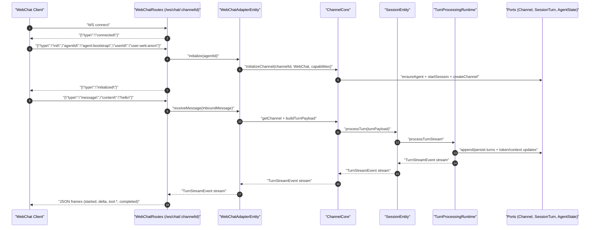
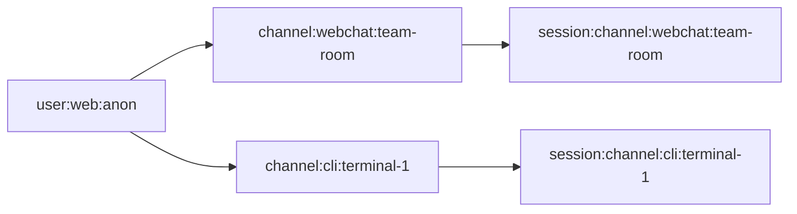

# Channel Adapter Architecture - Slice 1 (Greenfield Final): Foundation + CLI Migration + WebChat

**Date:** 2026-02-25
**Status:** COMPLETE — merged to main 2026-02-25 (13 commits, 174 tests passing)
**Revision:** User-decisions locked (streaming enabled, per-channel sessions, no backward compatibility)

## Locked Decisions

- Streaming gate is considered resolved for this slice.
- Session semantics are **per-channel only** in Slice 1.
- This is greenfield work: **no legacy data migration** and **no backward-compat shim requirements**.

## Scope

- Extract `ChannelCore` shared logic from current channel entity implementation.
- Rename/migrate CLI channel entity to `CLIAdapterEntity`.
- Add `AdapterProtocol` shared RPC surface.
- Add `WebChatAdapterEntity`.
- Add WebSocket transport route for WebChat using request-side upgrade API.
- Keep current HTTP/SSE channel routes functioning.

---

## Task 1: Domain types for channel adapters

**Files:**
- Modify: `packages/domain/src/status.ts`
- Modify: `packages/domain/src/index.ts`

### Step 1: Set ChannelType literals

```typescript
export const ChannelType = Schema.Literals([
  "CLI",
  "Messaging",
  "WebChat",
  "APIChannel",
  "VoiceChannel",
  "EmailChannel"
])
```

### Step 2: Add ChannelCapability literals

```typescript
export const ChannelCapability = Schema.Literals([
  "SendText",
  "SendFile",
  "Reactions",
  "Threads",
  "ReadReceipts",
  "Typing",
  "StreamingDelivery"
])
export type ChannelCapability = typeof ChannelCapability.Type
```

### Verify

```bash
bun run check
bun run test
```

---

## Task 2: Canonical InboundMessage schema

**Files:**
- Create: `packages/domain/src/channel.ts`
- Modify: `packages/domain/src/index.ts`
- Create: `packages/domain/test/ChannelSchema.test.ts`

### Schema requirements

- Use current Effect schema APIs:
  - `Schema.optional(...)`
  - `Schema.Record(Schema.String, Schema.Unknown)`
  - `Schema.DateTimeUtcFromString` for incoming timestamp strings

### Verify

```bash
bun run check
bun run test
```

---

## Task 3: ChannelRecord + persistence updates (greenfield schema shape)

**Files:**
- Modify: `packages/domain/src/ports.ts`
- Modify: `packages/server/src/persistence/DomainMigrator.ts`
- Modify: `packages/server/src/ChannelPortSqlite.ts`
- Modify: `packages/server/test/ChannelPortSqlite.test.ts`
- Modify: `packages/server/test/ChannelEntity.test.ts` (or renamed test file later)

### Step 1: Expand ChannelRecord

Add:

```typescript
readonly capabilities: ReadonlyArray<ChannelCapability>
```

### Step 2: Update channels table definition directly (no compatibility migration)

Because this slice is greenfield, update the channel table creation in `0003_channel_tables` to include:

```sql
capabilities_json TEXT NOT NULL DEFAULT '["SendText"]'
```

Do not add legacy data migration steps for prior channel types.

### Step 3: Update ChannelPortSqlite

- Include `capabilities_json` in SELECT/INSERT/CONFLICT update.
- Decode with schema validation (no raw cast after `JSON.parse`).
- Persist `channel.capabilities` as JSON.

### Verify

```bash
bun run check
bun run test
```

---

## Task 4: Add channels config support (domain + server)

**Files:**
- Modify: `packages/domain/src/config.ts`
- Modify: `packages/domain/test/ConfigSchema.test.ts`
- Modify: `packages/server/src/ai/AgentConfig.ts`
- Modify: `packages/server/test/AgentConfig.test.ts`
- Modify: `agent.yaml.example`

### Config shape

```yaml
channels:
  cli:
    enabled: true
  webchat:
    enabled: true
```

### Requirements

- Add channels schema at domain config layer.
- Surface channels in `AgentConfigService`.
- Default to `cli=true`, `webchat=true` if omitted.

### Verify

```bash
bun run check
bun run test
```

---

## Task 5: Extract ChannelCore with sharding-aware processing

**Files:**
- Create: `packages/server/src/ChannelCore.ts`
- Create: `packages/server/test/ChannelCore.test.ts`

### Requirements

- Extract shared logic from channel entity:
  - ensure agent state
  - idempotent channel/session initialization
  - payload building
  - history lookup
- Preserve session processing behavior:
  - Use `SessionEntity.client` when sharding supports it.
  - Keep direct runtime fallback only for test/mock sharding environments.

### Verify

```bash
bun run check
bun run test
```

---

## Task 6: Rename ChannelEntity to CLIAdapterEntity (no compatibility alias)

**Files:**
- Create: `packages/server/src/entities/CLIAdapterEntity.ts` (new canonical entity)
- Remove/replace: `packages/server/src/entities/ChannelEntity.ts`
- Modify: `packages/server/src/gateway/ChannelRoutes.ts`
- Modify: `packages/server/src/server.ts`
- Rename/modify tests:
  - `packages/server/test/ChannelEntity.test.ts` -> `packages/server/test/CLIAdapterEntity.test.ts`
  - any e2e imports still pointing at `ChannelEntity`

### Requirements

- Use entity name `"CLIAdapter"` and export `CLIAdapterEntity`.
- No backward-compat alias required.
- Delegate internals to `ChannelCore`.

### Verify

```bash
bun run check
bun run test
```

---

## Task 7: Define shared AdapterProtocol (streaming only)

**Files:**
- Create: `packages/server/src/entities/AdapterProtocol.ts`

### RPC surface

- `InitializeRpc`
- `ReceiveMessageRpc` (streaming `TurnStreamEvent`)
- `GetHistoryRpc`
- `GetStatusRpc`

### Requirements

- Include complete imports (`ContentBlock`, `ModelFinishReason`, etc.).
- Remove buffered fallback RPC from prior revisions.

### Verify

```bash
bun run check
bun run test
```

---

## Task 8: Implement WebChatAdapterEntity

**Files:**
- Create: `packages/server/src/entities/WebChatAdapterEntity.ts`
- Create: `packages/server/test/WebChatAdapterEntity.test.ts`

### Requirements

- Implements AdapterProtocol.
- `initialize` creates:
  - `channelType: "WebChat"`
  - `capabilities: ["SendText", "Typing", "StreamingDelivery"]`
- `receiveMessage` streams `TurnStreamEvent`.
- `getHistory` and `getStatus` implemented.
- Missing channel returns `ChannelNotFound`.

### Verify

```bash
bun run check
bun run test
```

---

## Task 9: Server wiring for CLI + WebChat adapters

**Files:**
- Modify: `packages/server/src/server.ts`

### Requirements

- Wire `ChannelCore`, `CLIAdapterEntity`, and `WebChatAdapterEntity` with real runtime dependencies.
- Keep config-gating:
  - `channels.webchat.enabled`
- Ensure current channel HTTP routes still function.

### Verify

```bash
bun run start
bun run check
bun run test
```

---

## Task 10: Add WebChat WebSocket transport routes

**Files:**
- Create: `packages/server/src/gateway/WebChatRoutes.ts`
- Modify: `packages/server/src/server.ts`
- Create: `packages/server/test/WebChatRoutes.e2e.test.ts`

### Transport contract

- `GET /ws/chat/:channelId`
- Use `request.upgrade`.
- On connect send: `{"type":"connected"}`
- Init frame required:
  - `{"type":"init","agentId":"agent:bootstrap","userId":"user:web:anon"}`
- Message frame:
  - `{"type":"message","content":"hello","threadId":"optional"}`
- Normalize to `InboundMessage` and stream adapter events back as JSON frames.

### Verify

```bash
bun run check
bun run test
```

---

## Task 11: End-to-end verification

Run:

```bash
bun run check
bun run test
bun run start
```

Confirm:

- `/channels/:channelId/create` works
- `/channels/:channelId/messages` SSE works
- `/ws/chat/:channelId` WebSocket flow works (init + message + streamed events)

---

## Message Flow + Test Matrix

### End-to-end message flow (WebChat, per-channel sessions)



### Session mapping (locked to per-channel)



### Test matrix to implement

| Scenario | Level | Expected |
|------|--------|----------|
| InboundMessage decodes valid payload | Domain unit | Decodes timestamp, metadata, attachments correctly |
| InboundMessage rejects malformed payload | Domain unit | Decode error with invalid timestamp/missing required fields |
| WebChat initialize is idempotent | Entity unit | Repeated init does not create duplicate channel/session |
| receiveMessage before initialize | Entity/route | Deterministic protocol or domain error |
| per-channel session key derivation | ChannelCore unit | Same `channelId` -> same session; different `channelId` -> different sessions |
| same user across two channels | Integration | No cross-channel session merge |
| event ordering for streamed turn | Entity integration | `turn.started` then deltas/tool events then `turn.completed` |
| history after processed turn | Entity integration | History contains expected user + assistant turns |
| concurrent messages on one channel | Integration | Serialized behavior; no turn index collisions |
| concurrent messages across channels | Integration | Independent processing with no cross-talk |
| model/tool failure surface | Integration | Error surfaced as failed turn/event path with consistent payload |
| websocket happy path | Route e2e | connect -> init -> message -> streamed frames |
| websocket malformed frame handling | Route e2e | clear error handling behavior (close or error frame) |
| websocket disconnect cleanup | Route e2e | no leaked fibers/subscriptions |
| route gate by config | Server integration | webchat route enabled/disabled by `channels.webchat.enabled` |
| existing HTTP/SSE routes regression | Route e2e | `/channels/*` endpoints remain green after adapter migration |

---

## Resolved Questions

1. **Ontology alignment for capabilities** — **Keep as domain enum.** `ChannelCapability` stays as `Schema.Literals` union for Slice 1. Map to full `ServiceCapability` ontology path in a later slice when `ExternalService`/`Integration` wiring is needed.

2. **WebChat authentication model** — **Trust init-frame userId.** No auth layer in Slice 1. The client-provided `userId` is accepted as-is. Token/session validation deferred to a security-focused slice.

3. **Reconnect/replay semantics** — **Fresh stream only.** Reconnect starts a new stream. Client can call `getHistory` to catch up if needed. No `lastEventSequence` replay in Slice 1.

4. **Backpressure policy** — **Buffer cap + disconnect.** Server buffers up to 256 events per WebSocket connection. If buffer fills (slow client), close the connection with a backpressure error code. Client is expected to reconnect.

---

## Files Summary

| File | Action |
|------|--------|
| `packages/domain/src/status.ts` | Set ChannelType + add ChannelCapability |
| `packages/domain/src/channel.ts` | Create InboundMessage/InboundAttachment |
| `packages/domain/src/index.ts` | Export new channel types/schemas |
| `packages/domain/src/ports.ts` | Add capabilities to ChannelRecord |
| `packages/domain/src/config.ts` | Add channels config schema |
| `packages/domain/test/ChannelSchema.test.ts` | Add inbound decode tests |
| `packages/domain/test/ConfigSchema.test.ts` | Add channels config tests |
| `packages/server/src/persistence/DomainMigrator.ts` | Update channel table shape for greenfield schema |
| `packages/server/src/ChannelPortSqlite.ts` | Persist + decode capabilities_json |
| `packages/server/src/ChannelCore.ts` | New shared service |
| `packages/server/src/entities/CLIAdapterEntity.ts` | New canonical CLI adapter entity |
| `packages/server/src/entities/AdapterProtocol.ts` | Shared adapter protocol RPCs |
| `packages/server/src/entities/WebChatAdapterEntity.ts` | New WebChat adapter |
| `packages/server/src/gateway/ChannelRoutes.ts` | Update CLI entity imports |
| `packages/server/src/gateway/WebChatRoutes.ts` | New WebSocket routes |
| `packages/server/src/ai/AgentConfig.ts` | Surface channels config + defaults |
| `packages/server/src/server.ts` | Wire ChannelCore + adapter entities + routes |
| `packages/server/test/CLIAdapterEntity.test.ts` | Renamed/updated CLI entity tests |
| `packages/server/test/WebChatAdapterEntity.test.ts` | New adapter tests |
| `packages/server/test/WebChatRoutes.e2e.test.ts` | New websocket e2e tests |
| `packages/server/test/ChannelRoutes.e2e.test.ts` | Keep existing SSE route tests green |
| `packages/server/test/AgentConfig.test.ts` | Add channels parsing tests |
| `agent.yaml.example` | Add channels section |
