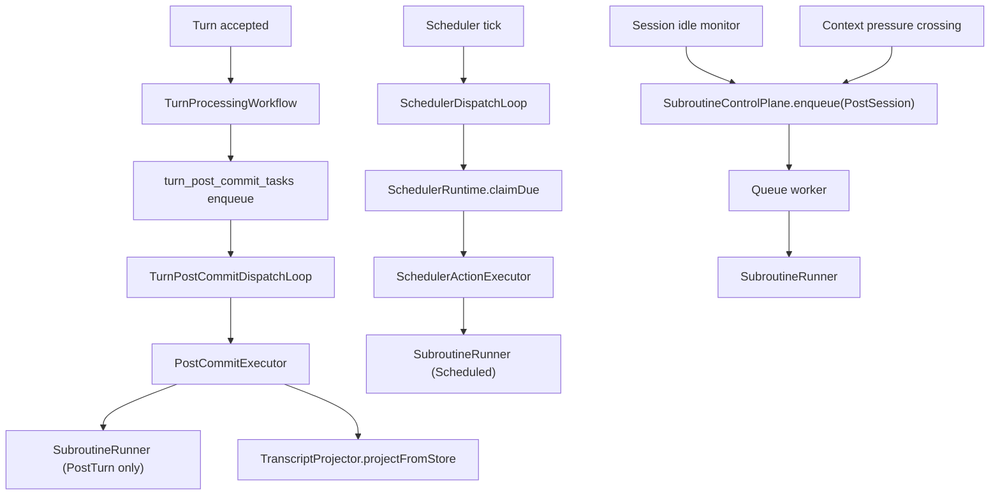
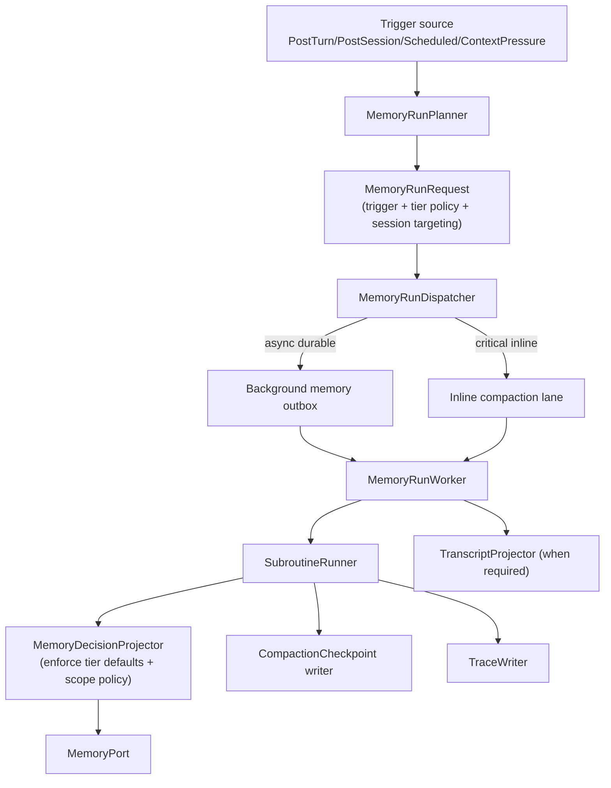

# Memory Compaction + Tier Semantics Around Scheduler/Post-Commit

**Date**: 2026-03-03  
**Status**: Draft (Deep-Dive Planning)  
**Goal**: Define a coherent, tier-aware memory architecture that uses the new scheduler and post-commit runtime paths while keeping API surface minimal, type-safe, and Effect-native.

---

## 1. Current Runtime Map (As Implemented)

### 1.1 Trigger/Execution Paths



### 1.2 Where Tiers Are Actually Used Today

1. `MemoryTier` is modeled in domain (`Working/Episodic/Semantic/Procedural`).
2. `store_memory` defaults to `SemanticMemory` when tool input omits `tier`.
3. `MemorySubroutineConfig.tier` exists, but is not enforced in runtime write behavior.
4. `SubroutineRunner` currently uses tier only for trace text labeling.

Net: tier semantics are mostly declarative/config-level, not execution-enforced.

### 1.3 Compaction Semantics Today

1. Compaction checkpoints are optional (`writesCheckpoint: true`).
2. Checkpoints are written only on successful subroutine completion.
3. Checkpoint payload is currently weakly populated (`tokensBefore/After`, kept anchors, details are often null).
4. No runtime consumes compaction checkpoints to rebuild context windows yet.

### 1.4 Artifact Semantics Today

1. `TranscriptProjector` is executed in post-commit and failure is treated as task failure (with retries + permanent fail).
2. `TraceWriter` failures are swallowed (best-effort diagnostics).
3. Compaction checkpoint write failures are non-fatal for subroutine success.

This is a good base pattern: required artifact vs optional artifact behavior is already present, but not formalized as a policy matrix.

---

## 2. Tightness and Gaps

## 2.1 Tight/Strong Areas

1. Durable post-commit outbox semantics with claim/retry/permanent-fail is solid.
2. Scheduler action payload is now typed and backward-compatible (`BackgroundAction`).
3. Subroutine execution contracts are typed and audited.
4. Tool scope enforcement is real (catalog/scope-group gating), not advisory.

## 2.2 Gaps To Close

1. **Split execution paths**: scheduler and post-commit invoke `SubroutineRunner` directly, while idle/context-pressure go through `SubroutineControlPlane`.
2. **Tier drift risk**: subroutine tier is not applied as runtime default for memory writes.
3. **ContextPressure is only proactive crossing detection**, not reactive overflow recovery.
4. **Scheduled subroutines use synthetic session ids** (`session:scheduled:<scheduleId>`), which can produce odd session-scoped memory placement.
5. **Compaction checkpoint is not yet actionable state**, only a partial record.

---

## 3. Proposed Coherent Tier Semantics

Use trigger + tier together as explicit contract.

## 3.1 Tier Roles

1. `WorkingMemory`: short-lived scratch/context aids; generally session-scoped.
2. `EpisodicMemory`: event summaries from specific turns/sessions; usually session-scoped first, optional promotion.
3. `SemanticMemory`: durable facts/preferences/invariants; mostly global scope.
4. `ProceduralMemory`: reusable behavior/rules/plans; global scope with stricter write criteria.

## 3.2 Trigger-to-Tier Guidance

1. `PostTurn`: primarily `Working` + `Episodic` capture.
2. `PostSession`: session summary into `Episodic`, optional semantic promotion.
3. `Scheduled`: consolidation/promotion (`Episodic -> Semantic`, `Semantic -> Procedural`).
4. `ContextPressure`: compaction path that can write checkpoint + targeted semantic/procedural summaries.

---

## 4. Target Architecture (Unification)



### Design rule

`SubroutineRunner` remains the model/tool loop primitive. Orchestration chooses lane:
1. async/durable lane for non-critical routines
2. inline lane for context-pressure recovery when needed

---

## 5. Minimal Interface Proposal

Keep API surface small by introducing one orchestration facade and one typed request.

## 5.1 `MemoryRunRequest`

```ts
interface MemoryRunRequest {
  runId: string
  triggerType: "PostTurn" | "PostSession" | "Scheduled" | "ContextPressure"
  triggerReason: string
  agentId: AgentId
  sessionRef: { mode: "existing"; sessionId: SessionId } | { mode: "synthetic"; key: string }
  conversationId: ConversationId
  turnId: TurnId | null
  subroutineId: string
  priority: "critical" | "normal"
}
```

## 5.2 `MemoryOrchestrator` facade

```ts
interface MemoryOrchestrator {
  dispatch(request: MemoryRunRequest): Effect.Effect<DispatchAck>
  runInline(request: MemoryRunRequest): Effect.Effect<SubroutineResult>
}
```

This consolidates scheduler/post-commit/control-plane callers to one entrypoint without growing public APIs.

---

## 6. Compaction Checkpoint Semantics (Upgrade)

Treat checkpoint as replayable compaction state, not just an audit row.

## 6.1 Populate mandatory fields for compaction-class runs

1. `tokensBefore` / `tokensAfter` from session context counters.
2. `firstKeptTurnId` + `firstKeptMessageId` when summarization drops prefix.
3. `detailsJson` includes deterministic summary metadata:
   - source turn window
   - tier write counts
   - model id
   - prompt hash/version

## 6.2 Add runtime consumers

1. `ContextPressure` reactive path can load latest checkpoint before retry.
2. Future transcript rebuild can anchor to checkpoint boundary.

---

## 7. Artifact Policy Matrix

Formalize behavior already present:

1. Required artifacts: transcript projection for post-commit.
   - Failure => task retry/permanent fail.
2. Optional artifacts: traces.
   - Failure => log warning only.
3. Conditional required artifacts: compaction checkpoint when routine class is compaction-critical.
   - For `ContextPressure` inline path, treat as required.
   - For maintenance routines, non-fatal allowed.

---

## 8. Config Model (User-Facing)

Add simple defaults so users do not hand-tune every subroutine.

## 8.1 Proposed additive config

```yaml
agents:
  default:
    memoryRoutines:
      defaults:
        tierPolicy:
          WorkingMemory:
            defaultScope: SessionScope
          EpisodicMemory:
            defaultScope: SessionScope
          SemanticMemory:
            defaultScope: GlobalScope
          ProceduralMemory:
            defaultScope: GlobalScope
        compaction:
          checkpointRequiredFor:
            - ContextPressure
      subroutines: []
      transcripts:
        enabled: true
        directory: transcripts
      traces:
        enabled: true
        directory: traces/memory
```

Keep this optional. If omitted, retain current behavior.

---

## 9. Phased Implementation Plan

## Phase 1: Semantic alignment (low risk)

1. Route scheduler and post-commit memory-subroutine invocation through `MemoryOrchestrator` facade.
2. Apply subroutine tier as default tier for `store_memory` when missing in tool params.
3. Add run classification (`critical` vs `normal`) and structured run metadata.

## Phase 2: Checkpoint hardening

1. Populate checkpoint fields (`tokensBefore/After`, anchors, detailsJson).
2. Add tests proving deterministic checkpoint content for compaction routines.

## Phase 3: Reactive context-pressure lane

1. Add inline compaction execution on overflow/fatal pressure.
2. One retry with checkpoint-informed reconstruction.
3. Emit explicit audit reason code for retry path.

## Phase 4: Cleanup + consolidation

1. Reduce direct call-sites to one orchestrator entry.
2. Keep `SubroutineRunner` as pure executor primitive.
3. Document artifact guarantees and operational alerts.

---

## 10. Immediate Actionable Recommendations

1. Implement `MemoryOrchestrator` as an internal server service (no external API change).
2. Add `defaultTier` in run context and thread it into `store_memory` handling.
3. Introduce a compaction routine marker (or infer from trigger + config) to decide checkpoint strictness.
4. For scheduled runs, explicitly declare session targeting strategy (synthetic/global vs selected active session) to avoid silent session-scope pollution.

---

## 11. Acceptance Criteria For This Design

1. Every trigger path can be traced to one orchestration surface.
2. Subroutine tier materially affects persisted writes by default.
3. Context-pressure has a critical inline option.
4. Compaction checkpoint rows are useful for replay/reconstruction, not null-heavy placeholders.
5. Artifact failure semantics are explicit and test-backed.
