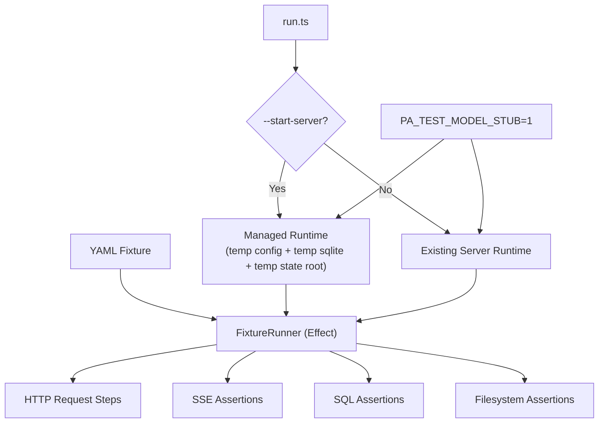

# E2E Fixture System

## Purpose

Provide a reusable, fixture-driven way to run endpoint-level flows against the live app runtime (including workflow/scheduler/compaction side effects) with deterministic behavior and explicit assertions.

## Architecture



## Step Types

- `set`: set variables (supports `{{uuid}}`, `{{now_iso}}`, and previously captured variables)
- `request`: HTTP request with JSON/SSE/text expectations and response capture
- `sql`: execute SQL plus row/count/value assertions (also supports capture)
- `file_exists`: assert expected file presence/absence
- `sleep`: fixed delay
- `repeat`: repeat any single nested step `N` times

## Variable Templating

- Strings can interpolate `{{varName}}` and dotted paths like `{{session.id}}`.
- Built-ins:
  - `{{uuid}}`
  - `{{now_iso}}`
  - `{{now_unix_ms}}`
  - `{{cwd}}`
  - `{{repo_root}}`
- Captures from `request` and `sql` steps are available to later steps.

## Runner Commands

Run against an already-running server:

```bash
bun packages/server/scripts/e2e/run.ts \
  --fixture fixtures/e2e/channel-smoke.yaml \
  --base-url http://localhost:3000 \
  --db-path /absolute/path/to/personal-agent.sqlite \
  --var state_root=/absolute/path/to/state
```

Run with managed isolated runtime (recommended):

```bash
bun packages/server/scripts/e2e/run.ts \
  --start-server \
  --fixture fixtures/e2e/channel-smoke.yaml \
  --fixture fixtures/e2e/compaction-workflow.yaml
```

Managed mode creates:

- temp config (prompt root rebased to repo `prompts/`)
- temp sqlite DB (`PERSONAL_AGENT_DB_PATH`)
- temp state root (`server.storage.rootDir`)
- deterministic model mode (`PA_TEST_MODEL_STUB=1` by default)

## Included Fixtures

- `fixtures/e2e/channel-smoke.yaml`
  - channel initialize
  - send message + SSE assertions
  - status/history checks
  - transcript/events filesystem checks

- `fixtures/e2e/compaction-workflow.yaml`
  - build sufficient chat history
  - force metrics pressure via SQL
  - trigger post-commit compaction dispatch
  - assert compaction checkpoint and artifact link
  - assert session filesystem outputs
